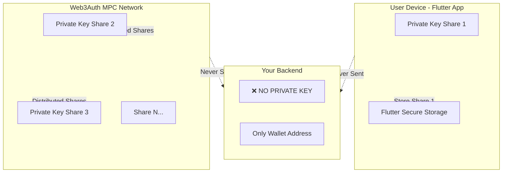

# 🔐 Private Key Storage Strategy - Web3Auth Non-Custodial Wallet

## ❓ **Pertanyaan: Dimana Private Key User Disimpan?**

### **Jawaban Singkat:**
**Private key TIDAK pernah disimpan sebagai 1 complete key!** Web3Auth menggunakan **MPC (Multi-Party Computation)** yang split private key menjadi multiple shares.

---

## 🏗️ **Arsitektur Private Key Storage**

### **Web3Auth MPC Architecture:**



---

## 📍 **Lokasi Private Key (Split Storage)**

### **1. User Device (Flutter App)**
**Location:** `FlutterSecureStorage` (encrypted local storage)

**What's Stored:**
```dart
// File: banking_app/lib/services/web3auth_service.dart
await _storage.write(
  key: 'web3auth_private_key', 
  value: response.privKey  // ← Ini adalah SHARE, bukan full key!
);
```

**Important:**
- ✅ Stored di **device local** (encrypted)
- ✅ **TIDAK pernah** dikirim ke backend
- ✅ **TIDAK pernah** dikirim ke Web3Auth servers
- ⚠️ Ini adalah **private key share**, bukan complete private key

### **2. Web3Auth MPC Network**
**Location:** Distributed across Web3Auth's MPC nodes

**What's Stored:**
- Multiple private key shares
- Distributed across different servers
- **No single server** has complete key
- Shares are encrypted and secured

### **3. Backend (Firebase Functions)**
**Location:** ❌ **TIDAK ADA PRIVATE KEY!**

**What's Stored:**
```typescript
// File: bangkingt_app_backend/src/index.ts
await db.collection("users").doc(uid).set({
  walletAddress: "0x...",  // ← Hanya wallet address
  // ❌ NO private key!
});
```

**Backend Hanya Punya:**
- ✅ Wallet address (public)
- ✅ User metadata (name, email)
- ❌ **TIDAK punya private key**
- ❌ **TIDAK bisa** sign transactions untuk user

---

## 🔒 **How MPC Works (Simplified)**

### **Traditional Wallet (Custodial):**
```
Private Key: 0x1234567890abcdef...
  ↓
Stored in ONE place (server/database)
  ↓
If compromised → ALL funds lost
```

### **Web3Auth MPC (Non-Custodial):**
```
Private Key: 0x1234567890abcdef...
  ↓
Split into 3 shares:
  - Share 1: 0xAAAA... (stored on user device)
  - Share 2: 0xBBBB... (stored on Web3Auth server 1)
  - Share 3: 0xCCCC... (stored on Web3Auth server 2)
  ↓
To sign transaction:
  - Need 2 out of 3 shares (threshold)
  - Shares combined temporarily (in memory only)
  - Transaction signed
  - Shares separated again
  ↓
If 1 share compromised → Still safe (need 2 shares)
```

---

## ✅ **Strategi yang Paling Tepat untuk Project Anda**

### **Recommended: Web3Auth MPC (Current Implementation)**

**✅ Keuntungan:**
1. **Non-Custodial:** User control funds
2. **Secure:** No single point of failure
3. **User-Friendly:** No seed phrase to manage
4. **Recovery:** Social recovery via Google login
5. **Backend Safe:** Backend tidak perlu handle private keys

**✅ Implementation:**
```dart
// Flutter App
final web3Auth = Web3AuthService();
await web3Auth.loginWithGoogle();

// Private key share stored locally
final privateKeyShare = await web3Auth.getPrivateKey();
// Stored in: FlutterSecureStorage (encrypted)

// Backend NEVER receives private key
// Backend only gets wallet address
```

---

## 🎯 **Security Best Practices (Sudah Diimplementasikan)**

### **✅ Yang Sudah Benar:**

1. **Private Key Share di Device:**
   - ✅ Stored in `FlutterSecureStorage` (encrypted)
   - ✅ Never sent to backend
   - ✅ Never logged or exposed

2. **Backend:**
   - ✅ Only stores wallet address (public)
   - ✅ Never requests private key
   - ✅ Cannot sign transactions for user

3. **Web3Auth:**
   - ✅ MPC network handles key shares
   - ✅ Threshold signature (need multiple shares)
   - ✅ Social recovery enabled

### **⚠️ Yang Perlu Diperhatikan:**

1. **Device Security:**
   - User harus protect device (PIN, biometric)
   - Jika device hilang → bisa recover via Web3Auth social recovery

2. **Backup:**
   - Web3Auth handle backup via social login
   - User bisa recover dengan Google account

3. **Transaction Signing:**
   - Semua signing dilakukan di device (Flutter)
   - Backend hanya broadcast signed transaction (optional)

---

## 📊 **Comparison: Storage Strategies**

| Strategy | Private Key Location | User Control | Security | Complexity |
|----------|---------------------|--------------|----------|------------|
| **Web3Auth MPC** (Current) | Split: Device + Web3Auth | ✅ High | ⭐⭐⭐⭐⭐ | ⭐⭐ Low |
| **Full Custodial** | Backend server | ❌ None | ⭐⭐ Low | ⭐⭐⭐ Medium |
| **Non-Custodial (Metamask)** | User device only | ✅ Full | ⭐⭐⭐⭐ High | ⭐⭐⭐⭐ High |
| **Hybrid (Current)** | Split: Device + Web3Auth | ✅ High | ⭐⭐⭐⭐⭐ | ⭐⭐ Low |

**Winner:** Web3Auth MPC ✅ (Current implementation)

---

## 🔍 **Verification: Private Key Tidak di Backend**

### **Check Backend Code:**
```typescript
// ✅ CORRECT - Only wallet address
await db.collection("users").doc(uid).set({
  walletAddress: userWalletAddress,  // Public address only
  // NO private key!
});

// ❌ WRONG - Never do this!
await db.collection("users").doc(uid).set({
  privateKey: "0x...",  // NEVER!
});
```

### **Check Firestore:**
```
users/
  └── {userId}/
      ├── walletAddress: "0x..."  ✅ Public
      ├── email: "user@gmail.com" ✅ Public
      └── privateKey: ???  ❌ Should NOT exist
```

### **Check Network Traffic:**
- ✅ Private key share hanya di device
- ✅ Tidak pernah dikirim via HTTP
- ✅ Tidak pernah di Firebase Functions

---

## 🎓 **Summary**

### **Dimana Private Key Disimpan?**

1. **User Device (Flutter):**
   - Private key **share** di `FlutterSecureStorage`
   - Encrypted, local only
   - Never sent to backend

2. **Web3Auth Network:**
   - Multiple shares distributed
   - Threshold signature (need 2+ shares)
   - Social recovery enabled

3. **Backend:**
   - ❌ **TIDAK ada private key**
   - ✅ Hanya wallet address (public)
   - ✅ Cannot sign transactions

### **Strategi Paling Tepat:**

✅ **Web3Auth MPC** (Current implementation)
- Non-custodial
- Secure (no single point of failure)
- User-friendly (no seed phrase)
- Backend safe (no key management)

---

## 📚 **References**

- Web3Auth MPC Docs: https://web3auth.io/docs/mpc
- Flutter Secure Storage: https://pub.dev/packages/flutter_secure_storage
- MPC Explained: https://en.wikipedia.org/wiki/Secure_multi-party_computation

---

**Status:** ✅ **Current implementation is CORRECT and SECURE!**

